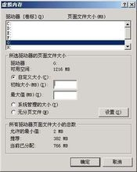

# Pr
##关于pr的内存不足，系统提示退出问题总结
  解决方法：通过更改系系统的虚拟内存。
- [设置原理](https://blog.csdn.net/u012861978/article/details/53048077)
- 虚拟内存：
> 虚拟内存别称虚拟存储器（Virtual Memory）。电脑中所运行的程序均需经由内存执行，若执行的程序占用内存很大或很多，则会导致内存消耗殆尽。为解决该问题，Windows中运用了虚拟内存 技术，即匀出一部分硬盘空间来充当内存使用。当内存耗尽时，电脑就会自动调用硬盘来充当内存，以缓解内存的紧张。若计算机运行程序或操作所需的随机存储器(RAM)不足时，则 Windows 会用虚拟存储器进行补偿。它将计算机的RAM和硬盘上的临时空间组合。当RAM运行速率缓慢时，它便将数据从RAM移动到称为“分页文件”的空间中。将数据移入分页文件可释放RAM，以便完成工作。 一般而言，计算机的RAM容量越大，程序运行得越快。若计算机的速率由于RAM可用空间匮乏而减缓，则可尝试通过增加虚拟内存来进行补偿。但是，计算机从RAM读取数据的速率要比从硬盘读取数据的速率快，因而扩增RAM容量（可加内存条）是最佳选择。

